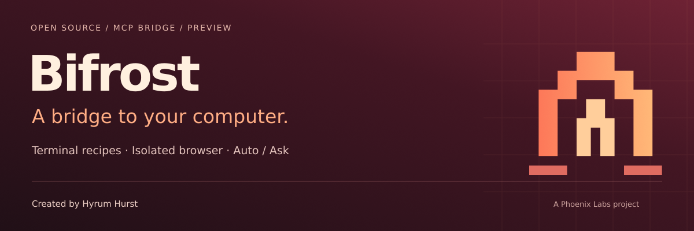
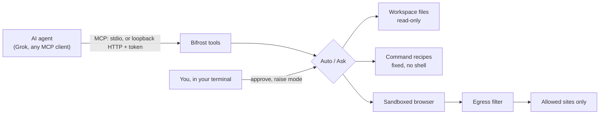

# Bifrost

**Let an AI agent work on your computer through doors you choose: fixed command recipes, a read-only workspace and a locked-down browser, with permissions enforced outside the agent's reach.**

[](https://github.com/hyrumhurst1/bifrost-device-mcp/actions/workflows/test.yml)
[](LICENSE)

Created by **Hyrum Hurst** · **A Phoenix Labs project**

[How it works](#how-it-works) · [Quick start](#quick-start) · [Security](#security-model) · [Test status](#test-status) · [Connecting Grok](docs/grok.md)

> **Developer preview for Linux and WSL2.** Tested end to end on Ubuntu 24.04 (WSL2) with a sandboxed Chromium: 63 tests, an MCP SDK smoke test and a hosted-agent HTTP check all pass. Not yet tested: a real Grok connection, remote access (Tailscale, tunnels) and macOS. Native Windows refuses to start. Bifrost is an application allowlist, not an OS sandbox.

## What it does

Bifrost is an [MCP](https://modelcontextprotocol.io) server you run on your own machine. Any MCP client can connect: a local host over stdio, or a hosted agent such as Grok over authenticated HTTP once you choose how to route it.

- **Read a workspace.** List and read files inside one dedicated directory. Traversal, symlinks and special files are refused.
- **Run your recipes.** You name exact commands with fixed arguments in a policy file. The agent picks a recipe by name; it cannot add arguments or use a shell.
- **Use a fresh browser.** Navigate, read, click, fill and screenshot in a separate headless Chromium with its sandbox on, a throwaway profile and an exact list of allowed sites. Every web request, including each redirect, goes through a filter that only lets those sites through.

## How it works



The rules live in the Bifrost process and in your terminal, not in the agent's conversation.

| Mode | What happens |
| --- | --- |
| **Auto** | The capabilities you configured run: your recipes, the workspace files and the allowed sites. |
| **Ask** | Each action waits. You see the exact action in your terminal and approve it there; an approval works once, for that action only, within 60 seconds of the request. |

The agent can lower its own access to Ask with `permissions_reduce`. It cannot raise the mode, approve its own requests, pass arguments to commands, read outside the workspace or browse outside the allowed sites. Chat messages and the client's own approval buttons do not count as your approval. Arbitrary shell access and a "bypass" mode are not supported.

## Tools

| Area | MCP tools |
| --- | --- |
| Files | `workspace_list`, `workspace_read` |
| Terminal | `terminal_tasks`, `terminal_run` |
| Browser | `browser_navigate`, `browser_snapshot`, `browser_click`, `browser_fill`, `browser_screenshot` |
| Session | `session_status`, `recent_receipts`, `permissions_reduce` |

## Requirements

- **Linux, or Windows with WSL2.** Tested on Ubuntu 24.04 under WSL2. macOS is untested. Native Windows is unsupported and refuses to start.
- **Node.js 22+** and **`/usr/bin/python3`**.
- **Playwright's Chromium with a working sandbox**, run as an ordinary user, never root. If the sandbox will not start (some distributions restrict unprivileged user namespaces), fix the host; never disable the sandbox.
- On WSL, keep the install, workspace and policy on the Linux filesystem (for example under `~`), not under `/mnt/c`. Files there look world-writable to Linux, and Bifrost refuses a policy anyone could edit.

## Quick start

```sh
git clone https://github.com/hyrumhurst1/bifrost-device-mcp.git
cd bifrost-device-mcp
npm ci --ignore-scripts
npx playwright install chromium

mkdir -p ~/bifrost-workspace ~/.config/bifrost
cp examples/policy.json ~/.config/bifrost/policy.json
chmod 600 ~/.config/bifrost/policy.json
```

Set the example recipe's `executable` to the absolute path from `command -v node`. It runs `node --version`. Then check the machine:

```sh
npm run check
```

Add Bifrost to your MCP host, replacing the paths:

```json
{
  "mcpServers": {
    "bifrost": {
      "command": "/absolute/path/to/node",
      "args": ["/absolute/path/to/bifrost-device-mcp/src/cli.js"],
      "env": {
        "BIFROST_WORKSPACE": "/home/you/bifrost-workspace",
        "BIFROST_POLICY": "/home/you/.config/bifrost/policy.json",
        "BIFROST_BROWSER_ORIGINS": "[]"
      }
    }
  }
}
```

Ask your client to list the workspace, show the terminal tasks and run `node-version`. The browser starts closed: set `BIFROST_BROWSER_ORIGINS` to exact origins such as `["http://127.0.0.1:8080"]` to open it to those sites only.

### Configuration

| Variable | Meaning |
| --- | --- |
| `BIFROST_WORKSPACE` | Required. The only directory the agent can read. Must not contain the Bifrost install. |
| `BIFROST_POLICY` | Your recipes: `{"tasks": {"name": {"executable": "/abs/path", "args": [], "timeoutMs": 10000}}}`. Outside the workspace, owned by you, not writable by others. |
| `BIFROST_BROWSER_ORIGINS` | JSON array of exact origins the browser may reach. Default `[]`. |
| `BIFROST_MODE` | `auto` (default) or `ask`. |
| `BIFROST_APPROVAL_CONSOLE` | `1` to open the owner console on your terminal. |
| `BIFROST_TRANSPORT` | `stdio` (default) or `http` (loopback only). |
| `BIFROST_PORT`, `BIFROST_HTTP_TOKEN` | HTTP port (default 7331) and a token of at least 32 characters that you generate. Bifrost never creates credentials. |
| `BIFROST_AUDIT_FILE` | Optional metadata-only receipt log, outside the workspace. |

## Approve actions from your terminal

Start Bifrost from your own terminal with `BIFROST_MODE=ask BIFROST_APPROVAL_CONSOLE=1` plus your workspace, policy and transport settings. The console reads your terminal directly, separate from MCP traffic:

```text
pending                 show waiting actions, exactly as they will run
approve REQUEST_ID      show that exact action; type yes to approve it once
mode auto | mode ask    change the mode
```

The agent then retries the same call with the `approvalId` it was given. Changed, expired, replayed or mode-invalidated approvals are refused. The console needs a terminal, so it is not available when an MCP host launches Bifrost in the background.

## Security model

- **Outside the agent's reach.** Mode and approvals live in the Bifrost process and change only from your terminal. The policy file sits outside the workspace and must not be writable by others. MCP can only lower permissions.
- **Exact actions.** You see the exact action before you confirm it. An approval is bound to the tool, its arguments and, for the browser, the current page; a click or fill cannot land on a page that replaced it. It expires after 60 seconds and works once.
- **No injection.** Recipes have fixed arguments and no shell. File access is descriptor-relative with no symlink following. Command errors do not reveal device paths.
- **Contained browser.** Fresh profile, sandbox required, downloads and popups blocked, WebSockets closed, and every web request and redirect checked against your exact origins.
- **Fails closed.** Bad configuration stops startup; HTTP is loopback-only and checks the token, Host and Origin.

Bifrost is an application allowlist, not an OS security boundary: recipes run as your user and can do whatever that user can. Keep recipes harmless and narrow, avoid credentials and consequential sites, and use a dedicated user, container or VM for untrusted workloads. Read [SECURITY.md](SECURITY.md) for the full model and residual risks.

## Test status

| Check | Result |
| --- | --- |
| `npm test`: 63 tests, including real sandboxed Chromium | Pass |
| `npm run smoke`: official MCP SDK client over stdio and loopback HTTP, real browser | Pass |
| `npm run agent-check`: raw JSON-RPC over authenticated HTTP, Ask approvals from a real console | Pass |
| `npm audit` | 0 known vulnerabilities |
| Real Grok connection | Not yet tested ([routes](docs/grok.md)) |
| Remote access: Tailscale, tunnels, public HTTPS | Not yet tested |
| macOS | Not yet tested |

Details, versions and exactly what each check covers: [verification record](docs/verification.md).

## Documentation

- [Connecting Grok](docs/grok.md): Grok Bot on your own computer, or remote HTTPS, and what each needs
- [Client compatibility](docs/compatibility.md): local hosts, Grok surfaces and deployment choices
- [Tailscale](docs/tailscale.md): private routing templates and their limits
- [Architecture](docs/architecture.md): modules, transports and approvals
- [Security](SECURITY.md): boundaries and residual risks
- [Brand assets](docs/assets/README.md): banner, social card, wordmark and icon

---

Created by **Hyrum Hurst** · **A Phoenix Labs project** · [MIT](LICENSE)

**Bifrost Device MCP** (`bifrost-device-mcp`) is an independent project, unrelated to other products or companies named Bifrost.
