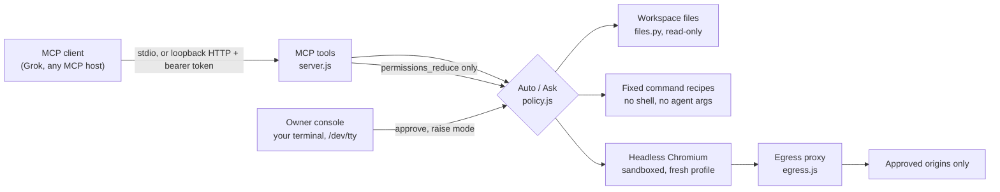

# Architecture

MCP host → official MCP SDK transport → tool schema validation → deterministic local policy → bounded capability adapter → result + redacted receipt.

- `src/cli.js`: entry point; stdio or authenticated loopback HTTP lifecycle
- `src/config.js`: launch configuration from environment variables; workspace, policy, recipe, origin and audit checks that fail closed
- `src/console.js`: local owner console on `/dev/tty`; approvals, mode changes, terminal-safe display of agent text
- `src/server.js`: twelve MCP tools, approval binding, execution epoch and browser document guards
- `src/policy.js`: Auto/Ask state, bounded pending queue, local-only decision methods, expiry and single-use consumption
- `src/bridge.js`: command admission/process groups, browser serialization/isolated context, file helper invocation, session health and a 100-receipt in-memory ring
- `src/egress.js`: loopback forward proxy that every browser request and redirect hop crosses; exact-origin allowlist
- `src/files.py`: POSIX descriptor-relative read/list implementation; no shell and no symlink following
- `scripts/smoke.js`: real SDK client/server integration against synthetic disposable fixtures
- `scripts/hosted-agent-check.js`: raw JSON-RPC over authenticated HTTP with Ask approvals from a real owner console on a pseudo-terminal

The official TypeScript SDK is pinned to the supported 1.32.1 compatibility line; this is not a claim of v2/latest-wire-spec conformance. Dependencies and versions are locked in `package-lock.json`. Playwright controls a browser this process launches, never the owner's personal Chrome. The HTTP transport is stateless and the capability/approval/browser state is process-global; do not serve multiple independent users.

Future high-privilege execution needs a separate constrained worker identity and a privileged, owner-authenticated policy broker that workers cannot rewrite or impersonate. A token accepted by an MCP host authenticates a caller; it is not evidence of human approval for a particular consequential action.
